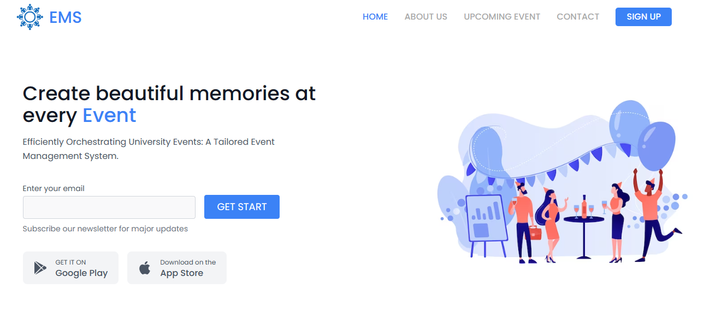

# Event Management System Website

Welcome to our Event Management System (EMS) website! This system is designed to streamline event planning, management, and attendee engagement. Below is a guide to help you navigate through the different sections of our website.

## Preview

## Live Preview
[Live Site](https://webycoderjatin.github.io/Event-Management-System/)

## Table of Contents

- [Homepage](#homepage)
- [About](#about)
- [Upcoming Events](#upcoming-events)
- [Contact](#contact)
- [Login](#login)

---

## Homepage

Our homepage serves as the central hub for all information related to our event management services. Here, you can find:

- An overview of our services and features.
- Testimonials from satisfied clients.
- Links to learn more about upcoming events and register.
- A call-to-action button to encourage users to sign up or log in.

---

## About

The About page provides detailed information about our company and team. You'll find:

- Our mission, vision, and values.
- Background information about our founders and team members.
- Our approach to event management and how we stand out from the competition.

---

## Upcoming Events

This section showcases a list of upcoming events organized by our team. You can:

- View event details such as date, time, location, and description.
- Register for events directly from the website.
- Get updates and notifications about upcoming events.

---

## Contact

Need to get in touch with us? The Contact page is where you can:

- Find our contact information, including email and phone number.
- Fill out a contact form for inquiries, feedback, or support.
- Connect with us on social media platforms for the latest updates.

---

## Login

For registered users, the Login page allows access to personalized features:

- Sign in with your username and password to access your account.
- Manage event registrations, tickets, and preferences.
- Interact with other attendees and network within the community.

---

Thank you for visiting our Event Management System website. We hope you find everything you need to plan and participate in successful events. If you have any questions or feedback, please don't hesitate to contact us. Enjoy your event experience with EMS!
